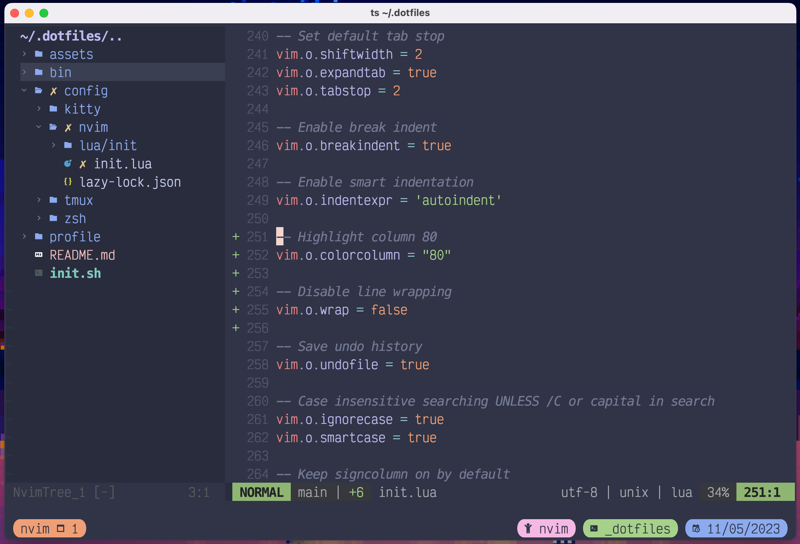

# dotfiles



### Usage

```sh
$ ./init.sh       # Will install dotfiles to ~/
$ ./init.sh -u    # Will uninstall dotfiles from ~/
```

You can preview changes without modifying anything by passing the `--dry-run` flag.
```sh
$ ./init.sh --dry-run    # Will show actions without actually performing them
```
